# Transaction tokens on AIC — architecture

Status: **agreed**, not built. Decisions settled 2026-08-28.

> A rendered version of this page — with the diagram drawn properly — is
> [`docs/architecture.html`](docs/architecture.html), also published at
> <https://claude.ai/code/artifact/c872b77c-7a16-4722-8e99-bb445fa6e71b>.

The pattern is `draft-ietf-oauth-transaction-tokens-11`: a user's access token
stops at the edge, and a short-lived **Txn-Token** carries the *authorized
intent* of one business transaction across every internal hop. The brief is in
[`docs/brief.md`](docs/brief.md).

**AIC is the Transaction Token Service.** We follow the spirit of the draft and
record where the product cannot match its letter — the list is short, and every
item on it is a wire *label* rather than a mechanism.

## Settled

| | |
| --- | --- |
| TTS | **AIC**, via the token-exchange grant plus an access-token-modification script |
| IdP | **AIC**, for real — the account manager signs in |
| manager↔client relationship | lives in **the app**; the TTS reads it and enriches `tctx` |
| storage | SQLite via `node:sqlite` |
| crypto | `jose`, RS256 — verification only; AIC signs |
| realm | `bravo`, alongside `capability-tokens` |
| services | Fastify |

## The shape

```mermaid
flowchart TB
    U(["Account manager"])

    subgraph aic ["PingOne AIC — the TTS"]
        direction LR
        AM["OAuth2 provider<br/>exchange grant"]
        VS["validate-scope script<br/><i>narrowing gate</i>"]
        ATM["token-modification script<br/><i>mints tctx / rctx</i>"]
        PDP["Policy engine<br/><i>issuance policy</i>"]
    end

    subgraph td ["Trust domain: acme-internal"]
        BFF["<b>BFF</b> · portal-bff"]
        API["<b>Activity API</b>"]
        LED["<b>Ledger</b>"]
        JOB["Nightly job"]
        DB[("SQLite")]
    end

    U -->|"1 · sign in"| AM
    U -->|"2 · POST /activities"| BFF
    BFF ==>|"3 · exchange + request_details"| AM
    AM --> VS
    VS -->|"4 · may this workload?"| PDP
    AM --> ATM
    ATM -.->|"5 · who is this manager&#39;s client?"| API
    ATM -->|"6 · assert these fields?"| PDP
    AM ==>|"7 · Txn-Token"| BFF
    BFF ==>|"8 · Txn-Token: header"| API
    API ==>|"9 · same bytes"| LED
    LED --> DB
    JOB ==>|"jwt-bearer, no user"| AM

    classDef a fill:#e8f0fe,stroke:#4285f4,stroke-width:2px
    classDef t fill:#fff4e5,stroke:#f59e0b,stroke-width:2px
    class AM,VS,ATM,PDP a
    class BFF,API,LED,JOB t
```



Bold edges carry the Txn-Token. It is minted once and reaches the ledger byte
for byte identical — **no mid-chain re-issuance** is the whole point.

Three services instead of five, because AIC absorbed the TTS: `portal-bff`
(9000, serves the SPA), `activity-api` (9002), `ledger-service` (9003), plus a
nightly `accrual-job`.

## What AIC can and cannot do — measured

Probed live in `bravo` on 2026-08-28 with a throwaway client pair and two
throwaway scripts, all deleted afterwards. Written up in
`pingone-aic-manager/docs/api/22-token-exchange.md`.

### Works

| Brief | How |
| --- | --- |
| §1 `request_context` / `request_details` | Arrive at the script as `requestProperties.requestParams.<name>` — single-element **arrays of strings**, so `JSON.parse(String(raw[0]))` |
| §2 `aud` = trust domain | `accessToken.setField("aud", "acme-internal")`. Needs **no** audience whitelist and no realm flag — the whitelist constrains the request *parameter*, not the claim |
| §2 `txn`, `sub`, `scope`, `req_wl` | `setField` |
| §2 `tctx` / `rctx` as nested objects | `setField` takes nested objects and they survive to the JWT intact |
| §2 60-second lifetime | the acting client's `accessTokenLifetime`, as in `capability-tokens` |
| §3 TTS authoritative + enrichment | the modification script has both **`httpClient`** and **`openidm`**, so the client tier and approval flag are a real lookup against the app |
| §4 scope narrowing | the validate-scope script, exactly as `capability-tokens` uses it |
| §6 validation at every hop | our services verify against the realm's JWKS |
| §8 issuance policy | AM policies. Both the validate-scope and modification scripts have a **`policy`** binding with `evaluate` / `evaluateTree` |

### Cannot

| Brief | Why | What we do |
| --- | --- | --- |
| §1 `requested_token_type: …txn_token` | **Hard `invalid_request`.** The one extra parameter AM rejects — bisected against a working control | Send the access-token URN; note it |
| §1 `issued_token_type` = the txn_token URN | AM reports what it issued | Note it |
| §1 `token_type: "N_A"` | AM says `Bearer` | Note it |
| §2 `typ: "txntoken+jwt"` | The header is not scriptable. `OAUTH2_SCRIPTED_JWT_ISSUER` has schema metadata but **no configuration hook anywhere in AIC** | Header stays `JWT`; note it |

All four are labels. Nothing about the *mechanism* — narrowing, enrichment,
propagation, per-hop validation, the issuance policy — is compromised, which is
what makes AIC-as-TTS a reasonable trade rather than a fudge.

### The one operational cost: AIC has to reach the app

The relationship lives in the app, so the token-modification script calls
`activity-api` to resolve it. That is a real outbound call from AIC to us, which
means **the app needs a public URL** — a `cloudflared` or `ngrok` tunnel for
local development, with the hostname in the gitignored `.env` and the shared
secret in an ESV.

Worth being clear that this is a property of the choice and not of the
mechanism: the alternative sources are no cheaper in code. A policy condition
script has **no `openidm` binding** — probed 2026-08-28 — so even "look it up in
IDM" is an outbound HTTP call from a script. The difference is only that IDM is
already reachable and the app is not.

The demo pays that cost deliberately, because "the PDP consulted the business
system" is the more interesting thing to show, and a tunnel is one command.

### One trap worth designing around

`setField` coerces numbers to doubles, so a bare `cost_cents` claim emits
`45000.0`. Boxing with `java.lang.Integer.valueOf` **only helps inside a nested
object** — at top level it is coerced anyway, and `java.lang.Long` and
`java.math.BigInteger` are not reachable at all. So:

```javascript
accessToken.setField("tctx", { cost_cents: java.lang.Integer.valueOf(45000) }); // 45000
accessToken.setField("cost_cents", java.lang.Integer.valueOf(45000));           // 45000.0
```

Money lives in `tctx`, which is where the draft wants it anyway.

## The token, concretely

```jsonc
// header — typ is "JWT"; see Cannot, above
{ "typ": "JWT", "alg": "RS256", "kid": "<realm signing key>" }
// payload
{
  "aud":    "acme-internal",              // the TRUST DOMAIN, set by script
  "txn":    "01JG7Q4T2VYB8K",             // one per business transaction
  "sub":    "am-alice",
  "iat":    1787923140, "exp": 1787923200,
  "scope":  "client:activity:write",      // internal intent, NOT the portal scope
  "req_wl": "portal-bff",
  "tctx": {
    "client_ref":     "client-4471",
    "activity_type":  "advisory",
    "cost_cents":     45000,
    "delivered_on":   "2026-08-21",
    "client_tier":    "gold",             // enriched from IDM, not requested
    "needs_approval": true                // enriched: cost > tier threshold
  },
  "rctx": { "ip": "203.0.113.7", "authn": "pwd", "portal": "acme-portal" }
}
```

The free-text note travels in the **request body**, never in `tctx`. Downstream
reads cost and type from `tctx`; if the body disagrees, the body loses.

## Observability

Every hop logs `{txn, workload, what it validated, what it decided}` and a
**hash** of the token, never the token. A `/trace/:txn` view renders the decoded
payload at each hop side by side, so it is visually obvious the same token
traversed the chain unchanged. That side-by-side is the screenshot this POC
exists to produce.

## Departures from the draft

1. `requested_token_type`, `issued_token_type`, `token_type` and the `typ`
   header — see [Cannot](#cannot). Product limits, measured.
2. **No mTLS on the BFF→AIC exchange.** The draft requires mutual
   authentication there because the access token is in flight. We use
   `client_secret_basic` and say so.
3. **No workload identity.** `Authorization` on internal hops is a stub bearer,
   not SPIFFE.
4. **One trust domain.** No cross-domain chaining.
5. **Signing keys are the realm's**, not TTS-specific. AIC owns them, which is
   arguably better than the draft's "static dev keys" concession.
6. **The TTS reaches back into the trust domain** to resolve the
   manager↔client relationship. The draft is silent on where a TTS gets its
   enrichment data; this is a design choice, not a departure, but it is the
   thing that makes the deployment need a tunnel.

## Open questions

Everything else is settled; these are what I would still like answered — see
the message accompanying this revision.
