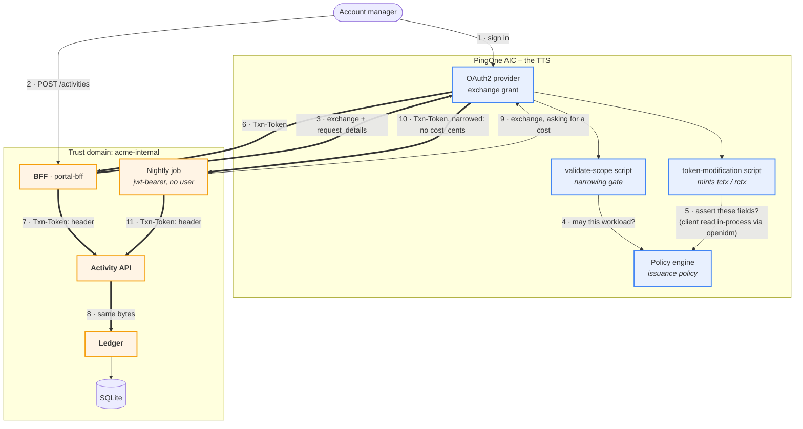

# Transaction tokens on AIC – architecture

Status: **built and running**. Decisions settled 2026-08-31; corrected against
the implementation after an adversarial review on 2026-09-01.

> A rendered version of this page – with the diagram drawn properly – is
> [`docs/architecture.html`](docs/architecture.html).

The pattern is `draft-ietf-oauth-transaction-tokens-11`: a user's access token
stops at the edge, and a short-lived **Txn-Token** carries the _authorized
intent_ of one business transaction across every internal hop. The brief is in
[`docs/brief.md`](docs/brief.md).

**AIC is the Transaction Token Service.** We follow the spirit of the draft and
record where the product cannot match its letter. That list used to say "short,
and every item on it is a wire _label_ rather than a mechanism". That was not
true, and the honest version is in [Departures](#departures-from-the-draft):
four are labels, and the rest are real reductions in what is enforced.

## Settled

|                                 |                                                                                                                                                                                                 |
| ------------------------------- | ----------------------------------------------------------------------------------------------------------------------------------------------------------------------------------------------- |
| Transaction Token Service (TTS) | **AIC**, via the token-exchange grant plus an access-token-modification script. Ideally, we'd use SPIRE. but this is to demonstrate the capability.                                             |
| Identity Provider (IdP)         | **AIC**, the account manager signs in.                                                                                                                                                          |
| manager↔client relationship    | lives in **AIC** – a custom managed object related to `bravo_user`, resolved in-process by the modification script's `openidm` binding, no outbound call                                        |
| storage                         | SQLite via `node:sqlite`                                                                                                                                                                        |
| crypto                          | `jose`, RS256 – verification only; AIC signs                                                                                                                                                    |
| services                        | Fastify                                                                                                                                                                                         |
| account manager `sub`           | human-readable, e.g. `am-alice` – not AIC's raw UUID                                                                                                                                            |
| nightly job                     | tries a cost-bearing entry, gets refused by the issuance policy because its subject token carries no account-manager scope, and records a cost-free entry instead – **the refusal is the demo** |

## The shape



Bold edges carry the Txn-Token. It is minted once and reaches the ledger byte
for byte identical – **no mid-chain re-issuance** is the whole point.

Three services instead of five, because AIC absorbed the TTS: `portal-bff`
(9000, serves the pages), `activity-api` (9002), `ledger-service` (9003), plus a
nightly `accrual-job` (`npm run job`, a one-shot script rather than a
scheduler).

Note the job makes **one** exchange, not two. It asks for a cost and gets a
Txn-Token back that simply has no `cost_cents` in it — the refusal narrows the
token rather than failing the call, so there is nothing to retry. An earlier
revision of this diagram drew a second, "fallback" call to AIC; no such call
exists.

## What AIC can and cannot do – measured

Probed live on 2026-08-28 with a throwaway client pair and two throwaway
scripts, all deleted afterwards. Written up in
`pingone-aic-manager/docs/api/22-token-exchange.md`.

### Works

| Brief                                    | How                                                                                                                                                                 |
| ---------------------------------------- | ------------------------------------------------------------------------------------------------------------------------------------------------------------------- |
| §1 `request_context` / `request_details` | Arrive at the script as `requestProperties.requestParams.<name>` – single-element **arrays of strings**, so `JSON.parse(String(raw[0]))`                            |
| §2 `aud` = trust domain                  | `accessToken.setField("aud", "acme-internal")`. Needs **no** audience whitelist and no realm flag – the whitelist constrains the request _parameter_, not the claim |
| §2 `txn`, `sub`, `scope`, `req_wl`       | `setField`                                                                                                                                                          |
| §2 `tctx` / `rctx` as nested objects     | `setField` takes nested objects and they survive to the JWT intact                                                                                                  |
| §2 60-second lifetime                    | the acting client's `accessTokenLifetime`, as in `capability-tokens`                                                                                                |
| §3 TTS authoritative + enrichment        | the modification script's **`openidm`** binding reads the manager↔client relationship and the client tier in-process – no network call, no tunnel                  |
| §4 scope narrowing                       | the validate-scope script, exactly as `capability-tokens` uses it                                                                                                   |
| §6 validation at every hop               | our services verify against the realm's JWKS                                                                                                                        |
| §8 issuance policy                       | AM policies. Both the validate-scope and modification scripts have a **`policy`** binding with `evaluate` / `evaluateTree`                                          |

### Cannot

| Brief                                      | Why                                                                                                                          | What we do                                                                 |
| ------------------------------------------ | ---------------------------------------------------------------------------------------------------------------------------- | -------------------------------------------------------------------------- |
| §1 `requested_token_type: …txn_token`      | **Hard `invalid_request`.** The one extra parameter AM rejects – bisected against a working control                          | Send the access-token URN, which AM accepts (verified 2026-09-01); note it |
| §1 `issued_token_type` = the txn_token URN | AM reports what it issued                                                                                                    | Note it                                                                    |
| §1 `token_type: "N_A"`                     | AM says `Bearer`                                                                                                             | Note it                                                                    |
| §2 `typ: "txntoken+jwt"`                   | The header is not scriptable. `OAUTH2_SCRIPTED_JWT_ISSUER` has schema metadata but **no configuration hook anywhere in AIC** | Header stays `JWT`; note it                                                |

These four are labels, and nothing about the _mechanism_ they name – narrowing,
enrichment, propagation, per-hop validation, the issuance policy – is
compromised by them. They are not, however, the whole list of ways this
implementation differs from the draft; see
[Departures](#departures-from-the-draft), which is longer and includes several
that are genuine reductions in authority rather than naming.

### The relationship lives in AIC, not the app

The manager↔client relationship is a custom IDM managed object
(`bravo_txn_client`) with a relationship to `bravo_user`. The token-modification
script's `openidm` binding reads it **in-process** – synchronous, no network
call, no tunnel. This is a reversal from the earlier design, made because setup
has to be a `terraform apply` plus a seed script, not "also stand up a tunnel."

Two things worth knowing before building it, both verified live on 2026-08-28
and written up in `pingone-aic-manager/docs/api/10-managed-objects.md`:

- A custom property or reverse-relationship key added to a Ping-shipped managed
  object (like `bravo_user`) **must** be prefixed `custom_` – not the realm
  prefix, not any other name – and it comes back unindexed.
- A relationship expansion via the `openidm` binding can read back **empty** for
  several seconds after a `config/managed` schema write, even though the REST
  API is correct throughout – a Terraform-apply-then-demo trap.

  What the script does about it, precisely: a `client_ref` the caller **named**
  that does not resolve **fails the mint**. Not naming one at all is legal (the
  nightly job never does), and then no client fields are attached. The earlier
  wording here said "fail closed on an empty expansion", and the code did the
  opposite — it dropped the unresolved reference and carried on minting, so a
  bogus `client_ref` plus a cost produced a costed token with no client on it.
  Verified, and fixed, 2026-09-01.

- **AIC does not synthesise the reverse side of a relationship.** Declaring
  `reverseRelationship` on the forward property annotates that property and
  nothing else; the reverse property has to be written onto the target object's
  own schema as a second, real property. `terraform-provider-pingone-aic` does
  this for us now — it did not when this demo was first built, which is why two
  provider fixes sit underneath it.

A policy-condition script has **no `openidm` binding** – probed 2026-08-28 – so
this trick is specific to the token-modification context.

### One trap worth designing around

`setField` coerces numbers to doubles, so a bare `cost_cents` claim emits
`45000.0`. Boxing with `java.lang.Integer.valueOf` **only helps inside a nested
object** – at top level it is coerced anyway, and `java.lang.Long` and
`java.math.BigInteger` are not reachable at all. So:

```javascript
accessToken.setField("tctx", { cost_cents: java.lang.Integer.valueOf(45000) }); // 45000
accessToken.setField("cost_cents", java.lang.Integer.valueOf(45000)); // 45000.0
```

Money lives in `tctx`, which is where the draft wants it anyway.

## The token, concretely

```jsonc
// header – typ is "JWT"; see Cannot, above
{ "typ": "JWT", "alg": "RS256", "kid": "<realm signing key>" }
// payload
{
  "aud":    "acme-internal",              // the TRUST DOMAIN, set by script
  "txn":    "01JG7Q4T2VYB8K",             // one per business transaction
  "sub":    "am-alice",
  "iat":    1787923140, "exp": 1787923200,
  "scope":  ["client:activity:write"],    // internal intent, NOT the portal scope
  "req_wl": "TxnDemo_caller",             // see Departures: one exchange client
  "tctx": {
    "client_ref":     "client-4471",      // vouched: the subject's own relationship
    "client_display": "Acme Holdings",    // vouched: enriched from IDM
    "client_tier":    "gold",             // vouched: enriched from IDM
    "activity_type":  "advisory",         // the caller's word, shape-checked
    "delivered_on":   "2026-08-21",       // the caller's word, shape-checked
    "cost_cents":     45000               // vouched: the issuance policy allowed it
  },
  "rctx": { "ip": "203.0.113.7", "authn": "pwd", "portal": "acme-portal" }
}
```

### Two kinds of `tctx` field, and the difference matters

Everything in `tctx` is bound to this one transaction under AIC's signature, so
no hop can alter it. That is not the same as AIC having _checked_ it, and
conflating the two is how a pattern like this gets oversold:

- **Vouched.** `client_ref`, `client_display` and `client_tier` come from IDM
  via the subject's own relationship — a caller cannot name a client the subject
  does not manage. `cost_cents` is present only because the issuance policy said
  so. Downstream may treat these as AIC's assertion.
- **Bound, not vouched.** `activity_type`, `delivered_on` and everything in
  `rctx` are the caller's own words. AIC validates their _shape_ and rejects the
  request outright if it is wrong — a non-string activity type, a malformed
  date, a negative cost — and then binds them. It does not claim they are true.

The free-text note travels in the **request body**, never in `tctx`. Downstream
reads cost and type from `tctx`; if the body disagrees, the body loses.

## Observability

Every hop records `{txn, workload, what it validated, what it decided}` and a
truncated SHA-256 **hash** of the token, never the token itself.
`GET /trail/:txn` on `portal-bff` renders the decoded payload at each hop side
by side — each column fetched from the service that produced it, not
reconstructed centrally — so the identical hash down the row is visible evidence
that the same token traversed the chain unchanged. That side-by-side is the
screenshot this POC exists to produce.

`shared/trail.js` is the whole of it: in-memory, capped, and holding no complete
token, so nothing in a trail can be replayed. Each service's own `/trail` still
sits behind the workload credential.

## Departures from the draft

An adversarial review on 2026-09-01 found the previous version of this list —
four items, all wire labels — materially incomplete. Several of these are
reductions in what is actually _enforced_, not naming differences, and saying
otherwise was the worst inaccuracy in this document. Items 1–6 are limits we
chose or the product imposed; **8–10 are places where the authority this demo
actually enforces is weaker than the draft's model**, and those are the ones
worth reading before quoting the demo at anyone.

1. _Product limit, measured._ `requested_token_type`, `issued_token_type`,
   `token_type` and the `typ` header – see [Cannot](#cannot). We do send
   `requested_token_type` and `audience`, which the draft requires and AM
   accepts; AM simply answers the first with the access-token URN rather than
   the draft's `txn_token` one.

2. _Deliberate._ **No mTLS on the BFF→AIC exchange.** The draft requires mutual
   authentication there because the access token is in flight. We use
   `client_secret_basic` and say so.
3. **Workload identity on internal hops is a shared secret**, not SPIFFE or
   mTLS. It IS a separate credential in `Authorization`, checked before the
   Txn-Token, so the draft's requirement that a Txn-Token must not authenticate
   its bearer holds. What it does **not** do is authenticate _which_ workload:
   every service presents the identical value, so `ledger-service` cannot tell
   `activity-api` from `portal-bff`, cannot require that its caller was the
   previous hop, and `activity-api` "presents its own" only in the sense that
   the bytes are not a replay of the inbound header. This is a separate
   shortfall from item 8 and worth counting separately.
4. **One trust domain.** No cross-domain chaining.
5. **Signing keys are the realm's**, not TTS-specific. AIC owns them, which is
   arguably better than the draft's "static dev keys" concession.
6. **Enrichment data lives inside AIC itself** (a custom managed object), not in
   the app's own database. The draft is silent on where a TTS gets its
   enrichment data; keeping it in AIC is what makes setup a `terraform apply`
   with no tunnel.

7. **The account manager's sign-in uses the password grant.** A real BFF uses
   `authorization_code`; nothing else in the pattern moves, and a scriptable
   demo beats a browser redirect here.
8. _Genuinely weaker than the draft's model._ **`req_wl` does not identify the
   requesting workload.** The draft defines it as the workload asking for the
   token, and expects the TTS to authorise that workload. Here both the portal
   and the nightly job authenticate the exchange as the single `TxnDemo_caller`
   client, so `req_wl` is `TxnDemo_caller` in every token and the issuance
   policy keys on the **subject token's scope** instead.

   This is a deliberate design choice, not an oversight: one internal exchange
   identity, with the gate keying on the subject token's own claims. It means
   the demo proves **subject-dependent claim filtering** — which is real, and is
   what the refusal demonstrates — and does _not_ prove per-workload issuance
   control. Anyone holding the shared caller secret and an account manager's
   subject token gets a cost-bearing token; the gate follows the subject, not
   the caller.

   Be careful with the phrase "who originated the request": the subject token
   carries the transaction's **principal**, which in the human path is the
   account manager, not the BFF. It says nothing about which workload asked.

   And "re-run on every mint" does not make a revocation immediate.
   `policy.evaluate` reads the `scope` claim frozen into the subject token, so
   editing the policy takes effect on the next mint, while removing a scope from
   the client configuration only affects subject tokens issued after it.

9. **The internally-initiated flow still mints an AIC user token first.** The
   draft's version has the job present a `self_signed` subject token with no
   user behind it. AM has no such token type, so the job signs an RFC 7523
   assertion (Trusted JWT Issuer, `aic jwt-bearer setup`) which AIC exchanges
   for an ordinary access token for a seeded `bravo_user` record — and _that_ is
   the subject token. So: no human, but there is an AIC user record and an
   AIC-issued subject token. The signing key is also the install's per-tenant
   key, shared with any other jwt-bearer use of the tenant, rather than one
   minted for the job.

10. **Replay is bounded by lifetime and idempotent storage, not by single-use
    enforcement.** A replayed token is refused with a 409 because the ledger's
    primary key is `txn`, not because any hop tracks spent tokens. The draft
    leaves strict single-use optional. The 60-second lifetime was chosen, not
    measured — we have not tested where it becomes too short in practice.

## Resolved

The two open questions from the previous revision are now settled:

- **Manager↔client relationship**: in AIC, not the app – see above.
- **Nightly job's purpose**: it exists to give the §8 issuance policy a second
  row to contrast against the account manager's. It attempts a cost-bearing
  entry, is refused because its subject token carries `job.accrual` rather than
  the account manager's `portal.activities`, and records a cost-free entry with
  the narrowed token it got back. The refusal is the demonstration, not an error
  case to hide.

  Exactly one change flips it: point `TxnDemoIssuance_AssertCost`'s
  `claim_value` at `local.subject_scopes.service` in `terraform/policy.tf` and
  the next mint gives the job its cost — and takes the account manager's away.
  That single-cause property is worth preserving: it is what makes the demo a
  demonstration of the policy rather than a coincidence of several
  independently-missing preconditions.
