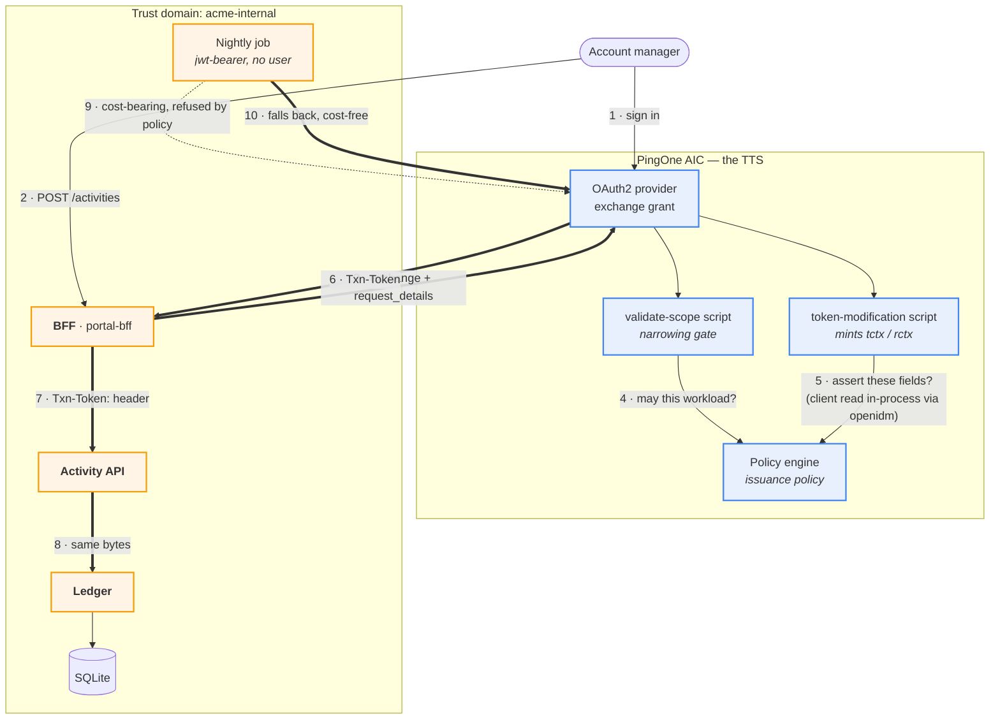

# Transaction tokens on AIC — architecture

Status: **agreed**, not built. Decisions settled 2026-08-31.

> A rendered version of this page — with the diagram drawn properly — is
> [`docs/architecture.html`](docs/architecture.html).

The pattern is `draft-ietf-oauth-transaction-tokens-11`: a user's access token
stops at the edge, and a short-lived **Txn-Token** carries the _authorized
intent_ of one business transaction across every internal hop. The brief is in
[`docs/brief.md`](docs/brief.md).

**AIC is the Transaction Token Service.** We follow the spirit of the draft and
record where the product cannot match its letter — the list is short, and every
item on it is a wire _label_ rather than a mechanism.

## Settled

|                              |                                                                                                                                                          |
| ---------------------------- | -------------------------------------------------------------------------------------------------------------------------------------------------------- |
| TTS                          | **AIC**, via the token-exchange grant plus an access-token-modification script                                                                           |
| IdP                          | **AIC**, for real — the account manager signs in                                                                                                         |
| manager↔client relationship | lives in **AIC** — a custom managed object related to `bravo_user`, resolved in-process by the modification script's `openidm` binding, no outbound call |
| storage                      | SQLite via `node:sqlite`                                                                                                                                 |
| crypto                       | `jose`, RS256 — verification only; AIC signs                                                                                                             |
| realm                        | `bravo`, alongside `capability-tokens`                                                                                                                   |
| services                     | Fastify                                                                                                                                                  |
| account manager `sub`        | human-readable, e.g. `am-alice` — not AIC's raw UUID                                                                                                     |
| nightly job                  | tries a cost-bearing entry, gets refused by the issuance policy because it isn't the BFF, falls back to a cost-free entry — **the refusal is the demo**  |

## The shape



Bold edges carry the Txn-Token. It is minted once and reaches the ledger byte
for byte identical — **no mid-chain re-issuance** is the whole point.

Three services instead of five, because AIC absorbed the TTS: `portal-bff`
(9000, serves the SPA), `activity-api` (9002), `ledger-service` (9003), plus a
nightly `accrual-job`.

## What AIC can and cannot do — measured

Probed live in `bravo` on 2026-08-28 with a throwaway client pair and two
throwaway scripts, all deleted afterwards. Written up in
`pingone-aic-manager/docs/api/22-token-exchange.md`.

### Works

| Brief                                    | How                                                                                                                                                                 |
| ---------------------------------------- | ------------------------------------------------------------------------------------------------------------------------------------------------------------------- |
| §1 `request_context` / `request_details` | Arrive at the script as `requestProperties.requestParams.<name>` — single-element **arrays of strings**, so `JSON.parse(String(raw[0]))`                            |
| §2 `aud` = trust domain                  | `accessToken.setField("aud", "acme-internal")`. Needs **no** audience whitelist and no realm flag — the whitelist constrains the request _parameter_, not the claim |
| §2 `txn`, `sub`, `scope`, `req_wl`       | `setField`                                                                                                                                                          |
| §2 `tctx` / `rctx` as nested objects     | `setField` takes nested objects and they survive to the JWT intact                                                                                                  |
| §2 60-second lifetime                    | the acting client's `accessTokenLifetime`, as in `capability-tokens`                                                                                                |
| §3 TTS authoritative + enrichment        | the modification script's **`openidm`** binding reads the manager↔client relationship and the client tier in-process — no network call, no tunnel                  |
| §4 scope narrowing                       | the validate-scope script, exactly as `capability-tokens` uses it                                                                                                   |
| §6 validation at every hop               | our services verify against the realm's JWKS                                                                                                                        |
| §8 issuance policy                       | AM policies. Both the validate-scope and modification scripts have a **`policy`** binding with `evaluate` / `evaluateTree`                                          |

### Cannot

| Brief                                      | Why                                                                                                                          | What we do                         |
| ------------------------------------------ | ---------------------------------------------------------------------------------------------------------------------------- | ---------------------------------- |
| §1 `requested_token_type: …txn_token`      | **Hard `invalid_request`.** The one extra parameter AM rejects — bisected against a working control                          | Send the access-token URN; note it |
| §1 `issued_token_type` = the txn_token URN | AM reports what it issued                                                                                                    | Note it                            |
| §1 `token_type: "N_A"`                     | AM says `Bearer`                                                                                                             | Note it                            |
| §2 `typ: "txntoken+jwt"`                   | The header is not scriptable. `OAUTH2_SCRIPTED_JWT_ISSUER` has schema metadata but **no configuration hook anywhere in AIC** | Header stays `JWT`; note it        |

All four are labels. Nothing about the _mechanism_ — narrowing, enrichment,
propagation, per-hop validation, the issuance policy — is compromised, which is
what makes AIC-as-TTS a reasonable trade rather than a fudge.

### The relationship lives in AIC, not the app

The manager↔client relationship is a custom IDM managed object
(`bravo_zzclient`, so named in the probe — the real demo will pick a proper
name) with a relationship to `bravo_user`. The token-modification script's
`openidm` binding reads it **in-process** — synchronous, no network call, no
tunnel. This is a reversal from the earlier design, made because setup has to be
a `terraform apply` plus a seed script, not "also stand up a tunnel."

Two things worth knowing before building it, both verified live on 2026-08-28
and written up in `pingone-aic-manager/docs/api/10-managed-objects.md`:

- A custom property or reverse-relationship key added to a Ping-shipped managed
  object (like `bravo_user`) **must** be prefixed `custom_` — not the realm
  prefix, not any other name — and it comes back unindexed.
- A relationship expansion via the `openidm` binding can read back **empty** for
  several seconds after a `config/managed` schema write, even though the REST
  API is correct throughout — a Terraform-apply-then-demo trap. The modification
  script should fail closed on an empty expansion rather than read it as "no
  relationship exists."

A policy-condition script has **no `openidm` binding** — probed 2026-08-28 — so
this trick is specific to the token-modification context.

### One trap worth designing around

`setField` coerces numbers to doubles, so a bare `cost_cents` claim emits
`45000.0`. Boxing with `java.lang.Integer.valueOf` **only helps inside a nested
object** — at top level it is coerced anyway, and `java.lang.Long` and
`java.math.BigInteger` are not reachable at all. So:

```javascript
accessToken.setField("tctx", { cost_cents: java.lang.Integer.valueOf(45000) }); // 45000
accessToken.setField("cost_cents", java.lang.Integer.valueOf(45000)); // 45000.0
```

Money lives in `tctx`, which is where the draft wants it anyway.

## The token, concretely

```jsonc
// header — typ is "JWT"; see Cannot, above
{ "typ": "JWT", "alg": "RS256", "kid": "<realm signing key>" }
// payload
{
  "aud":    "acme-internal",              // the TRUST DOMAIN, set by script
  "txn":    "01JG7Q4T2VYB8K",             // one per business transaction
  "sub":    "am-alice",
  "iat":    1787923140, "exp": 1787923200,
  "scope":  "client:activity:write",      // internal intent, NOT the portal scope
  "req_wl": "portal-bff",
  "tctx": {
    "client_ref":     "client-4471",
    "activity_type":  "advisory",
    "cost_cents":     45000,
    "delivered_on":   "2026-08-21",
    "client_tier":    "gold",             // enriched from IDM, not requested
    "needs_approval": true                // enriched: cost > tier threshold
  },
  "rctx": { "ip": "203.0.113.7", "authn": "pwd", "portal": "acme-portal" }
}
```

The free-text note travels in the **request body**, never in `tctx`. Downstream
reads cost and type from `tctx`; if the body disagrees, the body loses.

## Observability

Every hop logs `{txn, workload, what it validated, what it decided}` and a
**hash** of the token, never the token. A `/trace/:txn` view renders the decoded
payload at each hop side by side, so it is visually obvious the same token
traversed the chain unchanged. That side-by-side is the screenshot this POC
exists to produce.

## Departures from the draft

1. `requested_token_type`, `issued_token_type`, `token_type` and the `typ`
   header — see [Cannot](#cannot). Product limits, measured.
2. **No mTLS on the BFF→AIC exchange.** The draft requires mutual authentication
   there because the access token is in flight. We use `client_secret_basic` and
   say so.
3. **No workload identity.** `Authorization` on internal hops is a stub bearer,
   not SPIFFE.
4. **One trust domain.** No cross-domain chaining.
5. **Signing keys are the realm's**, not TTS-specific. AIC owns them, which is
   arguably better than the draft's "static dev keys" concession.
6. **Enrichment data lives inside AIC itself** (a custom managed object), not in
   the app's own database. The draft is silent on where a TTS gets its
   enrichment data; keeping it in AIC is what makes setup a `terraform apply`
   with no tunnel.
7. **The nightly job's `self_signed` subject_token has no AIC-native
   equivalent.** AM has no self-signed token type for token exchange; the job
   uses AIC's Trusted JWT Issuer / jwt-bearer feature (`aic jwt-bearer setup`)
   as the closest analog — a pre-registered issuer and signing key, not a token
   minted ad hoc by the job itself. It runs as an invokable
   `scripts/run-job.sh`, not a real scheduler.

## Resolved

The two open questions from the previous revision are now settled:

- **Manager↔client relationship**: in AIC, not the app — see above.
- **Nightly job's purpose**: it exists to give the §8 issuance policy a second
  row to contrast against the BFF's. It attempts a cost-bearing entry —
  something only the BFF may assert — gets refused by the issuance policy
  because it isn't the BFF, and falls back to writing a cost-free entry. The
  refusal is the demonstration, not an error case to hide.
