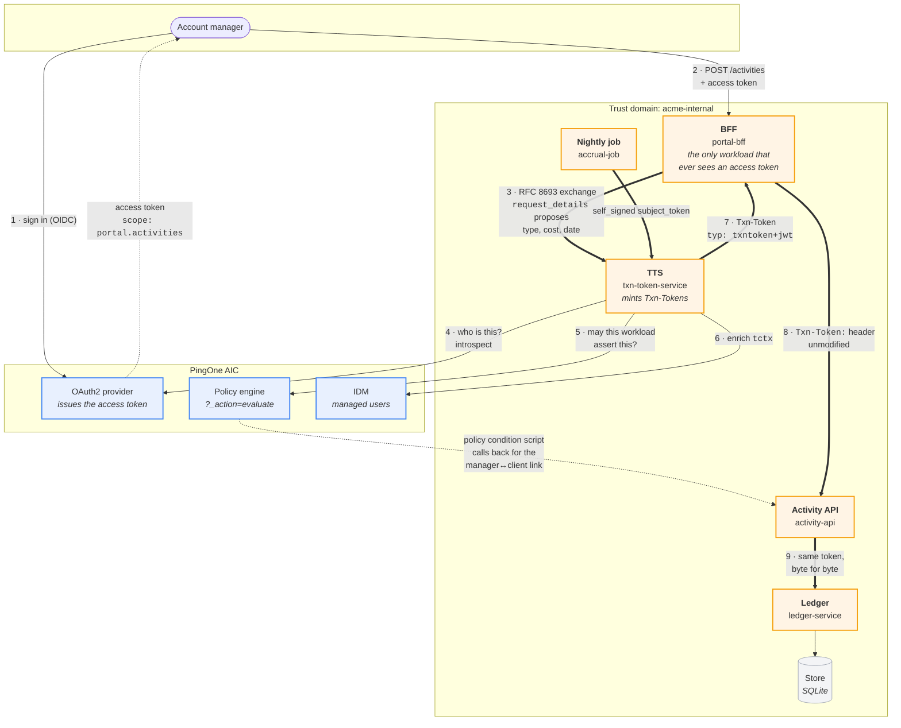

# Transaction tokens on AIC — architecture

Status: **proposed**. Nothing is built yet; [open questions](#open-questions)
are the things worth settling before it is.

> A rendered version of this page — with the diagram drawn properly — is
> [`docs/architecture.html`](docs/architecture.html), also published at
> <https://claude.ai/code/artifact/c872b77c-7a16-4722-8e99-bb445fa6e71b>.

The pattern is `draft-ietf-oauth-transaction-tokens-11`: a user's access token
stops at the edge, and a short-lived **Txn-Token** carries the *authorized
intent* of one business transaction across every internal hop. The brief is in
[`docs/brief.md`](docs/brief.md).

## The shape



Bold edges carry the Txn-Token. It is minted once, at step 7, and the same
bytes reach the ledger at step 9 — **no mid-chain re-issuance** is the whole
point.

## What sits where, and why

| Workload | Port | Holds | Never holds |
| --- | --- | --- | --- |
| `portal` (SPA, served by the BFF) | 9000 | a session cookie | any token |
| `portal-bff` | 9000 | the **access token** | a Txn-Token it did not just mint |
| `txn-token-service` | 9001 | the **signing key** | anything durable |
| `activity-api` | 9002 | the Txn-Token in flight | the access token |
| `ledger-service` | 9003 | the Txn-Token in flight | the access token |
| `accrual-job` | — | its own self-signed key | any user token |

Five processes so a token can be watched crossing four boundaries. The portal
is served by the BFF rather than run separately — one fewer process, and the
draft has nothing to say about how the SPA is delivered.

## The three decisions worth arguing about

### 1 · The TTS is ours, not AIC's

AIC's own token exchange is RFC 8693 and we already drove it in
[`../capability-tokens/`](../capability-tokens/). It is the wrong tool here,
for reasons that are properties of the product rather than of our
configuration:

- `requested_token_type` cannot be `…:token-type:txn_token`; AM issues access
  tokens, ID tokens and refresh tokens.
- The `typ: "txntoken+jwt"` header is not settable.
- `request_context` and `request_details` are draft-specific parameters. A
  `validate_scope` script *can* read arbitrary request parameters — we proved
  that in the capability-token demo — but it cannot make AM emit a token of a
  different type.
- **`audience` is accepted and silently ignored** unless
  `acceptAudienceParametersInTokenExchangeRequests` is on, and even then the
  Txn-Token's `aud` must be a *trust domain*, not a registered client.

So the TTS is a small fastify service. That is also what the draft describes —
a dedicated TTS is the pattern's central component, not an afterthought.

**AIC's role is real, not decorative:** it issues and introspects the account
manager's access token (§4 scope narrowing needs an authoritative answer to
"what scope does this subject token actually carry?"), and its policy engine is
the TTS issuance policy of §8.

### 2 · The issuance policy lives in AM

Brief §8 asks for "a simple, visible policy table: which workload may request
which scopes, and which may assert which `tctx` fields". That is an
authorization policy, and we have just built [`aic
policy`](https://github.com/agiledigital-labs/pingone-aic-manager) for exactly
this shape. Encoding it as AM policies means:

- it is Terraform-managed alongside everything else;
- `aic policy eval` explains a refusal, which is worth a lot in a demo whose
  whole point is legibility;
- "the BFF can assert a cost; the scheduled job cannot" becomes a policy diff
  rather than an `if` in the TTS.

Resource strings model the assertion, one per `tctx` field and one per scope:

```
txn:scope:client:activity:write
txn:tctx:cost
txn:tctx:activity_type
```

with the requesting workload as the subject. `aic policy eval` then answers
"why was the job refused?" directly.

### 3 · The manager↔client relationship — measured, not guessed

You asked whether policies could look in the *app* for the account
manager↔client relationship, or whether it would be much easier in IDM.

**They are the same mechanism, and the app is viable.** Probed live in `bravo`
on 2026-08-28:

- A `POLICY_CONDITION` script's bindings are `httpClient`, `logger`, `username`,
  `resourceURI`, `environment`, `advice`, `responseAttributes`, `authorized`,
  `realm`, `scriptName`. **There is no `openidm` binding** — so a policy cannot
  query IDM directly either.
- `httpClient` makes real outbound calls. A condition script fetched the
  tenant's own `/am/json/serverinfo/*` (200) **and** `https://example.com/`
  (200), using `new org.forgerock.http.protocol.Request()`.

So "look it up in IDM" and "look it up in the app" are both an outbound HTTP
call from a Rhino script. The trade-off is not effort, it is:

| | Relationship in the app | Relationship in IDM |
| --- | --- | --- |
| How the policy reads it | `httpClient` → `activity-api` | `httpClient` → `/openidm/managed/...` |
| Local dev | **needs a public URL** for the app (tunnel) | works as-is; IDM is already public |
| Auth for the call | a shared secret in an ESV | a service-account bearer, also in an ESV |
| Demo value | shows a PDP consulting a business system | shows IDM relationships |

There is a third option that avoids the egress entirely and is arguably the
most faithful to the draft: **the TTS resolves the relationship and enriches
`tctx` with it**, and the AM policy decides on the enriched claim. Brief §3
asks the TTS to add "at least one computed claim not present in the request"
anyway. The PDP then needs no callback, and the demo still shows AM deciding.

This is [open question 1](#open-questions).

## The token, concretely

```jsonc
// header
{ "typ": "txntoken+jwt", "alg": "RS256", "kid": "tts-dev-1" }
// payload
{
  "iss": "https://tts.acme-internal",     // optional per the draft; we set it
  "aud": "acme-internal",                 // the TRUST DOMAIN, not a service
  "txn": "01JG7Q…",                       // one per business transaction
  "sub": "am-alice",                      // the account manager
  "iat": 1787…, "exp": 1787… ,            // 60s
  "scope": "client:activity:write",       // internal intent, NOT the portal scope
  "req_wl": "portal-bff",                 // who asked
  "tctx": {                               // TTS is authoritative here
    "client_id_ref": "client-4471",
    "activity_type": "advisory",
    "cost_cents": 45000,
    "delivered_on": "2026-08-21",
    "client_tier": "gold",                //  ← enriched, not requested
    "needs_approval": true                //  ← enriched: cost > tier threshold
  },
  "rctx": { "ip": "203.0.113.7", "authn": "pwd+otp", "portal": "acme-portal" }
}
```

The free-text note travels in the **request body**, never in `tctx`. Downstream
reads cost and type from `tctx`; if the body disagrees, the body loses.

## The bit that makes it a demo

Every hop logs `{txn, workload, what it validated, what it decided}` and a
**hash** of the token — never the token itself. A `/trace/:txn` page renders
the decoded payload at each hop side by side, so it is visually obvious the
same token traversed the chain unchanged.

## Deliberate departures from the draft

To be filled in as they are hit. Known already:

- **No mTLS on BFF→TTS.** The draft requires mutual authentication there
  because the access token is in flight. We stub workload identity with a
  bearer and say so loudly.
- **Static dev keys** with a `kid`, in the repo, clearly marked.
- **One trust domain.** No cross-domain chaining.

## Open questions

1. **Where does the manager↔client relationship live?** Options and trade-offs
   in [§3](#3--the-managerclient-relationship--measured-not-guessed). The
   PDP-calls-the-app version is the most striking, and needs a tunnel.
2. **Storage.** SQLite via `node:sqlite` (zero dependencies, Node 22+) is the
   default unless you would rather see Postgres.
3. **Crypto.** `jose` — already used in `capability-tokens` — unless you want
   something else.
4. **Signing algorithm.** RS256 with a static dev keypair, or ES256?
5. **Does the account manager sign in for real?** The brief says stub the IdP,
   but AIC is right there and `capability-tokens` already has the journey
   plumbing. Real sign-in costs little and makes §4 (scope narrowing against a
   *real* subject token) meaningful rather than theatre.
6. **Realm.** `bravo` alongside `capability-tokens`, or its own?
